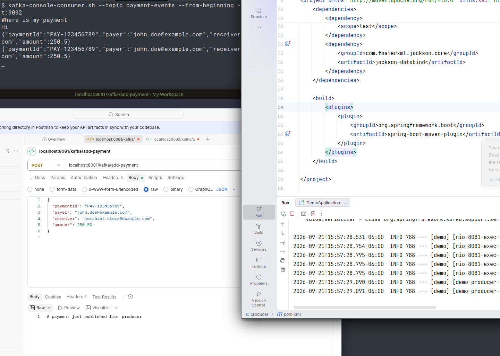
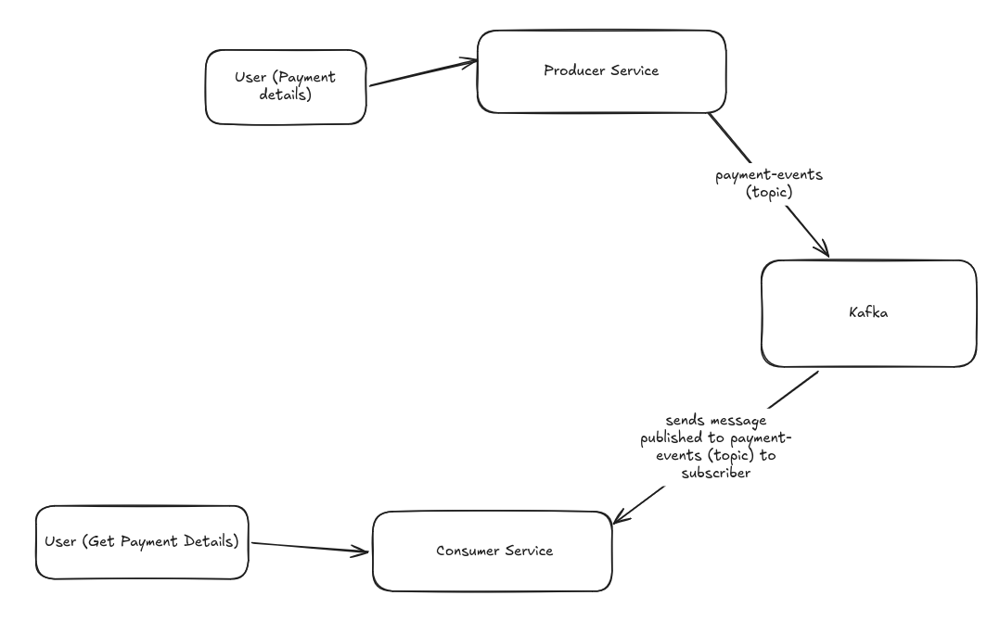
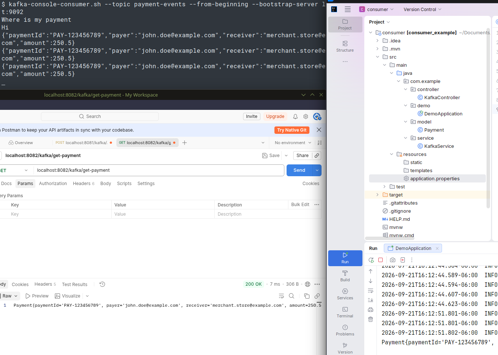

# Kafka Producer / Consumer Example

## Installation

Setup kafka using instructions from [here](https://kafka.apache.org/quickstart/). Make sure you have docker installed. After that get the kafka image.

`docker pull apache/kafka:4.3.1`

Run the image and bind it to port 9092

`docker run -p 9092:9092 apache/kafka:4.3.1`

Although, we don't need to install kafka (above command already did that), we need to be able to run 3 kafka commands (create a topic, and test producer and consumer, before writing code). Along with running above commands, download the kafka archive from above link, and make sure the commands are executable from your command line.

## Create a topic

Let's create a topic called `payment-events` where we will publish payment events. 

`$ kafka-topics.sh --create --topic payment-events --bootstrap-server localhost:9092`

You should see following message
`Created topic payment-events.`

## Produce and Consume a message (Test setup)

To produce / add message use following command. It will open up a prompt, where you can write message and the next command (consumer) will listen to messages that you can see

Start producer and send message `Hi`

`$ kafka-console-producer.sh --topic payment-events --bootstrap-server localhost:9092`  

`> Hi`  

Listend to that message in the consumer

`$ kafka-console-consumer.sh --topic payment-events --from-beginning --bootstrap-server localhos  
t:9092  
Hi`

If you are able to see the message, your setup is complete.

## Java Producer

Create a spring project using spring-initializer, add Spring Web and Kafka. Add following classes

**Payment (model class)**

```java
package com.example.model;

public class Payment {
    private String paymentId;
    private String payer;
    private String receiver;
    private double amount;

    public Payment() {}

    public String getPaymentId() {
        return paymentId;
    }

    public void setPaymentId(String paymentId) {
        this.paymentId = paymentId;
    }

    public String getPayer() {
        return payer;
    }

    public void setPayer(String payer) {
        this.payer = payer;
    }

    public String getReceiver() {
        return receiver;
    }

    public void setReceiver(String receiver) {
        this.receiver = receiver;
    }

    public double getAmount() {
        return amount;
    }

    public void setAmount(double amount) {
        this.amount = amount;
    }

    @Override
    public String toString() {
        return "Payment{" +
                "paymentId='" + paymentId + '\'' +
                ", payer='" + payer + '\'' +
                ", receiver='" + receiver + '\'' +
                ", amount=" + amount +
                '}';
    }
}
```

**KafkaService (Service class)**

Here, we will use KafkaTemplate to send message to **payment-events** topic, key is **payment** (String) and value is 

```java
package com.example.service;

import com.example.model.Payment;
import org.springframework.beans.factory.annotation.Autowired;
import org.springframework.kafka.core.KafkaTemplate;
import org.springframework.stereotype.Service;

@Service
public class KafkaService {
    @Autowired
    private KafkaTemplate<String, Payment> kafkaTemplate;

    public String sendMessage(Payment payment) {
        kafkaTemplate.send("payment-events", "payment", payment);
        return "A payment just published from producer";
    }
}
```

**KafkaController (Controller class)**

This class will send user's request through `KafkaService`

```java
package com.example.controller;

import com.example.model.Payment;
import com.example.service.KafkaService;
import org.springframework.beans.factory.annotation.Autowired;
import org.springframework.http.HttpStatus;
import org.springframework.http.ResponseEntity;
import org.springframework.web.bind.annotation.PostMapping;
import org.springframework.web.bind.annotation.RequestBody;
import org.springframework.web.bind.annotation.RequestMapping;
import org.springframework.web.bind.annotation.RestController;

@RestController
@RequestMapping("/kafka")
public class KafkaController {

    @Autowired
    private KafkaService service;

    @PostMapping("/add-payment")
    public ResponseEntity<String> addPayment(@RequestBody Payment payment) {
        String response = service.sendMessage(payment);
        return new ResponseEntity<String>(response, HttpStatus.OK);
    }
}
```

**Kafka Server Configuration**

Since we used string as key and Payment object (JSON) as value, we need to add some parameters, so that KafkaTemplate knows about the servers. Since we need to run both producer and consumer as services, I have setup **producer** server to run at port **8081**, and **consumer** server will use port **8082**, and we also need to tell, **kafka** is running at port **9092**. You can change the ports (8081 and 8082) to some other ports, if they are already used.

**application.properties**

```properties
server.port=8081

spring.application.name=demo

spring.kafka.bootstrap-servers=localhost:9092
spring.kafka.producer.key-serializer=org.apache.kafka.common.serialization.StringSerializer
spring.kafka.producer.value-serializer=org.springframework.kafka.support.serializer.JsonSerializer
```

**Jackson Databinder**

Finally, since we have used `JsonSerializer` we need to also use `jackson-databind` package. Add following dependency to `pom.xml`.

```xml
<dependency>
    <groupId>com.fasterxml.jackson.core</groupId>
    <artifactId>jackson-databind</artifactId>
</dependency>
```

Now, you can start the server and publish a message. If you have not closed the client console, you can still see the message. I have used postman to publish a message.



## Java Consumer

Client also works in similar way. We will use a listener to listen to message, and populate a variable, that we can get when the client asks it. In a real world app, most of the times it does not work that way, because there is no point in waiting for the app if you can use it right away. However, if the server is bombarding the client with messages, we need to implement other resilliency mechanisms (like circuit breaker, exponential backoff with jitter etc.).

 

Below are classes that are in Consume (except the Payment class, which is same in both)

**KafkaService (Service class)** Here groupId can be anything. We need @KafkaListener to listen to messages as it is produced and Kafka sends it immediately. Since the User at Get Payment Details, can query the website anytime, we will save it to a message variable and return it, when user visits a particular link (/get-payment)

```java
package com.example.service;

import com.example.model.Payment;
import org.springframework.kafka.annotation.KafkaListener;
import org.springframework.stereotype.Service;

@Service
public class KafkaService {

    private String message;

    @KafkaListener(topics="payment-events", groupId = "mygroup1")
    public void consumeMessage(Payment payment) {
        message = payment + " got the data from kafka";
        System.out.println(message);
    }

    public String getMessage() {
        return message;
    }

}
```

**Controller**

Here, we will expose the /get-payment URL for the user to see the latest payment message.

```java
package com.example.controller;

import com.example.service.KafkaService;
import org.springframework.beans.factory.annotation.Autowired;
import org.springframework.http.HttpStatus;
import org.springframework.http.ResponseEntity;
import org.springframework.web.bind.annotation.GetMapping;
import org.springframework.web.bind.annotation.RequestMapping;
import org.springframework.web.bind.annotation.RestController;

@RestController
@RequestMapping("/kafka")
public class KafkaController {
    @Autowired
    private KafkaService service;

    @GetMapping("/get-payment")
    public ResponseEntity<String> getPayment() {
        String response = service.getMessage();
        return new ResponseEntity<String>(response, HttpStatus.OK);
    }
}
```

**Properties**

The application.properties has few more additions. Here, we added the group-id and instead of serializer, we used the deserializer counterparts (from what was used to the Producer). Also, as mentioned above, I started the consumer client at port 8082.

```properties
spring.application.name=demo_client
server.port=8082

spring.kafka.bootstrap-servers=localhost:9092
spring.kafka.consumer.group-id: mygroup1
spring.kafka.consumer.key-deserializer=org.apache.kafka.common.serialization.StringDeserializer
spring.kafka.consumer.value-deserializer=org.springframework.kafka.support.serializer.JsonDeserializer
spring.kafka.properties.spring.json.trusted.packages=com.example.model
```

Finally, don't forget to add the `jackson-databind` dependency as we added to the producer service.

We can run the client and get the message using Postman (or cURL).



## Run

To run the projects you can use IDE (two instances), or you can run is from command line using

`./mvnw spring-boot:run`

You need to do it for both producer and consumer separately.


## Conclusion

With above commands and setup, you should be able to run both consumer and producer of Kafka and publish and consume messages.


